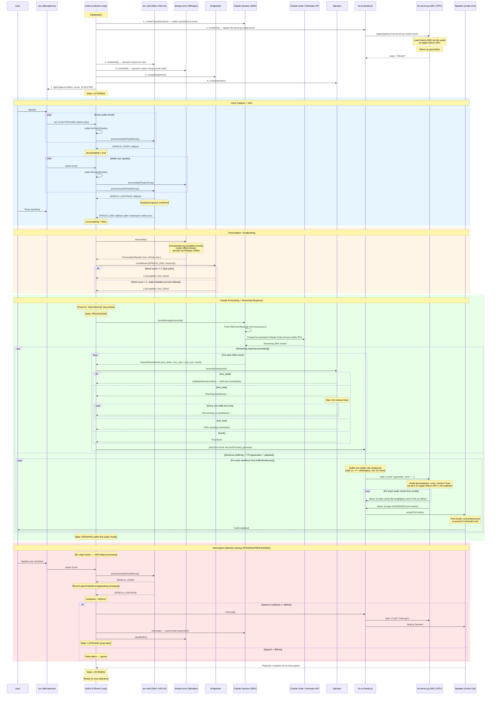

# Voice Pipeline Sequence Diagram

TTS runs as a persistent Python child process (`tts-server.py`) spawned once at startup. The Kokoro-82M model is loaded onto the Apple Silicon GPU via mlx-audio and stays in memory for the entire session. Node.js (`tts.ts`) communicates with it over stdio pipes — JSON commands on stdin, length-prefixed binary PCM on stdout. No HTTP server or network involved.

